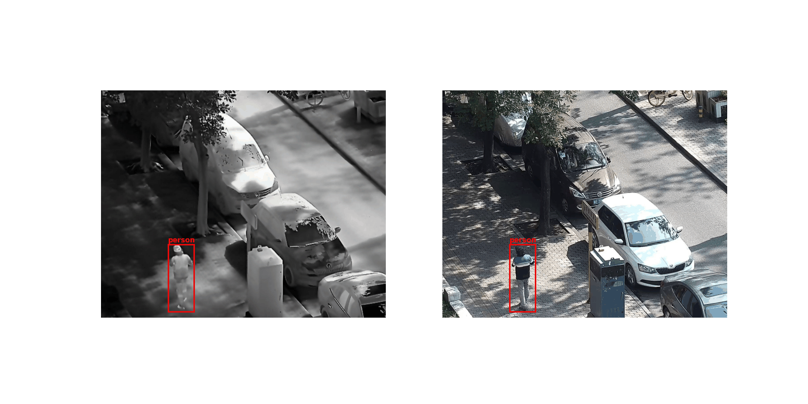

# Annotation Conversion and Visualization Scripts

This subfolder contains several miscellaneous scripts used in the study, such as the `voc-to-coco` conversion script. Scripts for annotation (conversion and monitoring) are adapted for the LLVIP dataset, but feel free to modify them for the FLIR-aligned dataset (minor adjustments required).

---

## Voc-to-COCO Converter

A script has been provided to convert VOC/XML annotations from the LLVIP dataset into a COCO/JSON-like format, which is easier to handle with DETR-like models. 

### Example Command:
You need to download the original annotation files beforehand.

```bash
python3 voc_to_coco.py --annotation_path ./dir/to/xml --json_save_path ./name/of/json/out/file
```

The script gathers and converts each XML file in the input folder into a COCO/JSON-like file.

---

## Label and boxes visualization Script

A script for visualizing annotations on images or image pairs to verify the LLVIP dataset conversion. The `--mode` argument allows you to monitor annotations either in mono-spectrum mode (`mono`) or on both image pairs (`multi`) for a randomly selected image.

### Example Command:
```bash
python3 visualize_random_img.py --images_dir /dir/to/spectrum1/test \
                                --annotation_file /dir/to/coco/LLVIP_test.json \
                                --mode multi \
                                --secondary_images_dir /dir/to/spectrum2/test
```

---

<figure>
<p align="center">
  
</p>
<figcaption style="text-align: center; font-style: italic;">Examples of image pairs with our converted annotations (LLVIP dataset).</figcaption>
</figure>

---

### Notes:
- Adjust the file paths in the commands according to your directory structure.
- For `--mode multi`, ensure both image directories have matching filenames.

---

